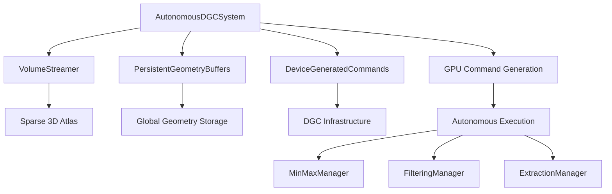

# Autonomous GPU-Driven Streaming System

## Overview

The MeshTrex autonomous streaming system implements a fully GPU-driven architecture for rendering massive volumes that exceed device memory. The system achieves true GPU autonomy through NVIDIA's Device Generated Commands (DGC) extension, allowing the GPU to decide what to process based on extraction state and memory constraints.

### Design Principles

1. **GPU Autonomy**: GPU makes all extraction and memory management decisions
2. **Persistent Geometry**: Extract once, render many times
3. **Sparse Virtual Texturing**: Page-based streaming for volumes exceeding GPU memory
4. **Control Hierarchy**: Isovalue as primary control, camera as secondary
5. **Progressive Extraction**: Maintain interactivity during parameter changes

## System Architecture



## Key Components

### 1. Direct Component Integration

The system uses direct component integration without an intermediate orchestrator:

```cpp
// Create core components directly
VolumeStreamer volumeStreamer(context, streamParams);
PersistentGeometryBuffers persistentBuffers(context);
DeviceGeneratedCommands dgcCommands(context);
AutonomousDGCSystem autonomousSystem(context, &dgcCommands);

// Initialize components
volumeStreamer.loadVolume(volumePath);
persistentBuffers.initialize();
dgcCommands.initialize();
autonomousSystem.initialize(dgcConfig);
```

**Key Design Decision:**
- No intermediate orchestrator class
- Direct component composition
- Each manager (MinMax, Filtering, Extraction) operates independently
- AutonomousDGCSystem coordinates GPU-driven execution

### 2. AutonomousDGCSystem

Implements GPU-driven command generation based on extraction state:

```cpp
struct ExtractionState {
    float currentParameter;      // Current isovalue
    float previousParameter;     // Previous isovalue
    uint32_t framesSinceChange;  // Frames since parameter changed
    uint32_t parameterChanged;   // 1 if parameter changed
    uint32_t totalPagesToExtract;
    uint32_t pagesExtractedSoFar;
    uint32_t extractionComplete;
};

struct MemoryState {
    uint32_t totalPages;
    uint32_t maxResidentPages;
    uint32_t currentResidentPages;
    uint32_t entireVolumeFits;  // 1 if volume fits in memory
    uint32_t memoryPressure;
    uint32_t visiblePageCount;
};
```

**GPU Autonomous Workflow:**
1. Analyzes extraction state to detect parameter changes
2. Determines memory constraints and volume fit status
3. Prioritizes pages based on visibility (for large volumes)
4. Generates extraction commands autonomously

### 2. PersistentGeometryBuffers

Manages global geometry buffers that accumulate extraction results:

```cpp
struct PersistentGeometryBuffers {
    Buffer vertexBuffer;      // 50M vertices capacity
    Buffer indexBuffer;       // 150M indices capacity
    Buffer meshletBuffer;     // 500K meshlets capacity
    Buffer indirectBuffer;    // Draw commands
    
    std::atomic<uint32_t> currentVertexOffset;
    std::atomic<uint32_t> currentIndexOffset;
    std::atomic<uint32_t> currentMeshletOffset;
};
```

**Key Features:**
- Eliminates per-page temporary buffers
- Enables geometry reuse across frames
- Supports incremental updates during extraction
- Allows efficient culling without re-extraction

### 3. VolumeStreamer

Implements sparse virtual texturing for streaming large volumes:

```cpp
class VolumeStreamer {
    VkImage sparseImage;         // 1024³ sparse 3D texture
    Buffer pageTableBuffer;      // Virtual-to-physical mapping
    
    // Page management
    uint32_t pageSize = 32;      // 32³ voxels per page
    std::vector<PageEntry> pageTable;
    std::queue<uint32_t> freePages;
    
    // Background streaming
    std::thread streamingThread;
    std::queue<PageRequest> loadQueue;
    std::queue<PageRequest> evictQueue;
};
```

**Streaming Strategy:**
- Sparse 3D image with page-based binding
- Background thread for disk I/O
- LRU eviction for memory management
- Priority-based page loading

### 4. DeviceGeneratedCommands

Low-level wrapper for NVIDIA's DGC extension:

```cpp
class DeviceGeneratedCommands {
    VkIndirectCommandsLayoutNV indirectCommandsLayout;
    Buffer commandBuffer;       // GPU-generated commands
    Buffer preprocessBuffer;    // DGC preprocessing
    Buffer sequencesCountBuffer; // Number of commands
    
    void recordExecuteCommands(VkCommandBuffer cmd, 
                              VkPipeline pipeline, 
                              uint32_t maxSequenceCount);
};
```

## GPU Autonomy Architecture

### Command Generation Shader

The `autonomousExtractionSelection.comp.glsl` shader implements the GPU's decision-making:

```glsl
// Pass 0: State Analysis
if (extractionState.parameterChanged != 0) {
    // Mark all pages invalid on isovalue change
    atomicStore(pageValidity.validity[pageIndex], 0);
}

// Pass 1: Memory Analysis
uint32_t residentCount = 0;
for (uint32_t i = 0; i < totalPages; i++) {
    if (pageResidency.resident[i] != 0) {
        residentCount++;
    }
}
memoryState.currentResidentPages = residentCount;

// Pass 2: Prioritization
float priority = 0.0;
if (memoryState.entireVolumeFits == 0) {
    // Large volume - use view-based prioritization
    if (isPageInFrustum(pageCenter, viewParams)) {
        priority = 2.0;
    }
} else {
    // Small volume - extract everything
    priority = 1.0;
}

// Pass 3: Command Generation
if (priority > 0.0 && pageValidity.validity[pageIndex] == 0) {
    uint32_t cmdIndex = atomicAdd(commandQueue.count, 1);
    if (cmdIndex < maxCommands) {
        commandQueue.commands[cmdIndex].commandType = EXTRACT_CMD_FULL;
        commandQueue.commands[cmdIndex].pageCoord = ivec3(pageX, pageY, pageZ);
        commandQueue.commands[cmdIndex].priority = priority;
    }
}
```

## Streaming Pipeline Flow

### Frame Execution

```cpp
// Initialize components
VolumeStreamer volumeStreamer(context, streamParams);
PersistentGeometryBuffers persistentBuffers(context);
DeviceGeneratedCommands dgcCommands(context);
AutonomousDGCSystem autonomousSystem(context, &dgcCommands);

volumeStreamer.loadVolume(volumePath);
persistentBuffers.initialize();
dgcCommands.initialize();
autonomousSystem.initialize(dgcConfig);
autonomousSystem.setExtractionParameter(isovalue);

// Main render loop
while (running) {
    // 1. Handle control variable changes
    if (isovalueChanged) {
        autonomousSystem.setExtractionParameter(newIsovalue);
        persistentBuffers.reset();  // Clear accumulated geometry
    }
    
    if (cameraChanged && !volumeFitsInMemory) {
        autonomousSystem.updateViewParameters(view, proj, position);
    }
    
    // 2. Execute autonomous frame
    VkCommandBuffer cmd = beginSingleTimeCommands(device, commandPool);
    
    // GPU autonomously decides what to extract and executes
    autonomousSystem.executeAutonomousFrame(cmd, frameIndex);
    
    endSingleTimeCommands(device, commandPool, queue, cmd);
    
    // 3. Render can happen separately using persistent buffers
    // The geometry is already in persistentBuffers and can be rendered
    // with culling shaders at any time
}
```

### Per-Page Extraction Pipeline

1. **Min-Max Octree Generation**
   - `streamingMinMax.comp.glsl`: Generate leaf level (5³ cells)
   - `streamingOctreeReduce.comp.glsl`: Build hierarchy (32³→16³→8³→4³→2³→1³)

2. **Active Block Filtering**
   - `streamingOccupiedBlockPrefixSum.comp.glsl`: Stream compaction
   - Tests isovalue intersection: `isoValue ∈ [minVal, maxVal]`
   - Outputs compact list of active blocks

3. **Mesh Extraction (PMB)**
   - `streaming_marching_cubes_pmb.task.glsl`: Count primitives
   - `streaming_marching_cubes_pmb.mesh.glsl`: Generate geometry
   - Writes directly to persistent buffers

4. **Culling & Rendering**
   - `persistent_geometry_culling.task.glsl`: Per-meshlet frustum culling
   - `persistent_geometry_rendering.mesh.glsl`: Final rendering

## Shader Pipeline

### Streaming-Aware Patterns

All streaming shaders follow consistent patterns:

```glsl
// 1. Check page residency
uint32_t pageIndex = getPageIndex(coord);
if (!isPageResident(pageIndex)) {
    return; // Skip non-resident pages
}

// 2. Calculate atlas coordinates
vec3 atlasCoord = virtualToAtlas(coord, pageIndex);

// 3. Sample from sparse atlas
float value = texture(sparseAtlas, atlasCoord).r;

// 4. Write to persistent buffers
uint32_t offset = atomicAdd(globalOffsets.vertexCount, vertexCount);
for (uint32_t i = 0; i < vertexCount; i++) {
    vertices.data[offset + i] = vertex;
}
```

### Push Constants for Page Data

```glsl
layout(push_constant) uniform PushConstants {
    uint32_t pageCoordX;
    uint32_t pageCoordY;
    uint32_t pageCoordZ;
    uint32_t mipLevel;
    uint32_t globalVertexOffset;
    uint32_t globalIndexOffset;
    uint32_t globalMeshletOffset;
} pc;
```

## Memory Management

### Page-Based Streaming

```cpp
struct PageEntry {
    uint32_t virtualPageIndex;  // Virtual page coordinate
    uint32_t physicalPageIndex; // Physical atlas location
    uint32_t lastAccessFrame;   // For LRU eviction
    uint32_t residencyStatus;   // 0=not resident, 1=resident
};
```

### Persistent Buffer Management

```cpp
// Allocation strategy
const uint32_t MAX_VERTICES = 50'000'000;
const uint32_t MAX_INDICES = 150'000'000;
const uint32_t MAX_MESHLETS = 500'000;

// Ring buffer allocation
uint32_t allocateVertices(uint32_t count) {
    uint32_t offset = currentVertexOffset.fetch_add(count);
    if (offset + count > MAX_VERTICES) {
        // Handle wrap-around or reallocation
    }
    return offset;
}
```

## Control Variable Hierarchy

### Primary Control: Isovalue

- Triggers complete re-extraction of all pages
- Most expensive operation in the system
- Progress tracked via `pagesExtractedSoFar / totalPagesToExtract`

```cpp
void setExtractionParameter(float isovalue) {
    // Update GPU state
    ExtractionState state;
    state.currentParameter = isovalue;
    state.parameterChanged = 1;
    state.totalPagesToExtract = totalPageCount;
    state.extractionComplete = 0;
    
    // GPU will mark all pages invalid
    updateGPUBuffer(extractionStateBuffer, &state);
}
```

### Secondary Control: Camera

- Only affects large volumes that don't fit in memory
- Controls page loading/eviction priority
- Does NOT trigger re-extraction

```cpp
void updateViewParameters(const glm::mat4& view, 
                         const glm::mat4& proj,
                         const glm::vec3& position) {
    if (volumeFitsInMemory) {
        return; // Camera doesn't affect small volumes
    }
    
    // Update frustum for page prioritization
    calculateFrustumPlanes(view, proj);
    updateGPUBuffer(viewParametersBuffer, &frustumData);
}
```
The maxMeshlets default of 500,000 (500K) is defined for these reasons:

  1. Relationship to vertices and indices: Each meshlet in a mesh shader can have up to 256 vertices and 256 primitives (triangles). With 50M vertices and 150M indices (50M triangles), the theoretical
  minimum number of meshlets needed would be:
    - 50M vertices / 256 vertices per meshlet = ~195,313 meshlets
    - 50M triangles / 256 triangles per meshlet = ~195,313 meshlets
  2. Overhead for partial meshlets: In practice, meshlets are rarely perfectly filled. The marching cubes algorithm generates varying amounts of geometry per block, so many meshlets will be partially
  filled. A 2.5x overhead (500K / 195K) provides reasonable buffer space.
  3. Memory efficiency: Each meshlet descriptor is relatively small (typically 16-32 bytes), so 500K meshlets only consume:
    - 500K * 16 bytes = 8 MB (minimal compared to vertex/index data)
  4. Alignment with block processing: The streaming system processes blocks of 4³ cells. With worst-case marching cubes (5 triangles per cell), that's 320 triangles per block, requiring at least 2
  meshlets per block. For a large volume, 500K meshlets provides good coverage.
  5. Future-proofing: The value allows for extraction of complex isosurfaces without running out of meshlet descriptors, while not over-allocating memory.

  The choice reflects a balance between supporting large, complex extractions and memory efficiency.
## Configuration Parameters

```cpp
struct SystemConfig {
    // Volume parameters
    uint32_t volumeDimensions[3];
    uint32_t pageSize = 32;
    
    // Memory limits
    uint32_t maxResidentPages;      // Based on GPU memory
    float targetMemoryUsage = 0.8f;  // 80% of VRAM
    
    // Execution parameters
    uint32_t maxCommandsPerFrame = 64;  // Throttle extraction
    bool prioritizeVisible = true;       // For large volumes
    
    // Geometry limits
    uint32_t maxVertices = 50'000'000;
    uint32_t maxIndices = 150'000'000;
    uint32_t maxMeshlets = 500'000;
};
```

## Performance Characteristics

### Extraction Performance

| Operation | Cost | Time | Memory Impact |
|-----------|------|------|---------------|
| Isovalue Change | O(n) pages | Progressive | Invalidates all geometry |
| Camera Movement | O(1) | Immediate | May trigger page loads |
| Page Extraction | O(32³) voxels | ~2-5ms | Adds to persistent buffers |
| Rendering | O(visible meshlets) | Constant | Reads persistent buffers |

### Memory Usage

```
Total VRAM = Sparse Atlas + Page Table + Persistent Buffers + Working Memory

Sparse Atlas: 1024³ × 1 byte = 1 GB
Page Table: maxPages × 16 bytes = ~16 MB
Persistent Buffers:
  - Vertices: 50M × 32 bytes = 1.6 GB
  - Indices: 150M × 4 bytes = 600 MB
  - Meshlets: 500K × 64 bytes = 32 MB
Working Memory: ~500 MB
```

## Error Handling

The system includes robust error handling:

1. **Page Allocation Failures**: Graceful degradation when memory full
2. **DGC Limits**: Respects maximum commands per frame
3. **Buffer Overflow**: Ring buffer wrap-around for persistent geometry
4. **Streaming Failures**: Fallback to low-resolution data

## Shader Summary

| Shader | Purpose | Stage |
|--------|---------|-------|
| `autonomousExtractionSelection.comp` | GPU command generation | Compute |
| `streamingMinMax.comp` | Min-max leaf generation | Compute |
| `streamingOctreeReduce.comp` | Octree hierarchy building | Compute |
| `streamingOccupiedBlockPrefixSum.comp` | Active block filtering | Compute |
| `streaming_marching_cubes_pmb.task` | Primitive counting | Task |
| `streaming_marching_cubes_pmb.mesh` | Geometry generation | Mesh |
| `persistent_geometry_culling.task` | Frustum culling | Task |
| `persistent_geometry_rendering.mesh` | Final rendering | Mesh |

All shaders are streaming-aware, check page residency, and support GPU-driven execution through Device Generated Commands.